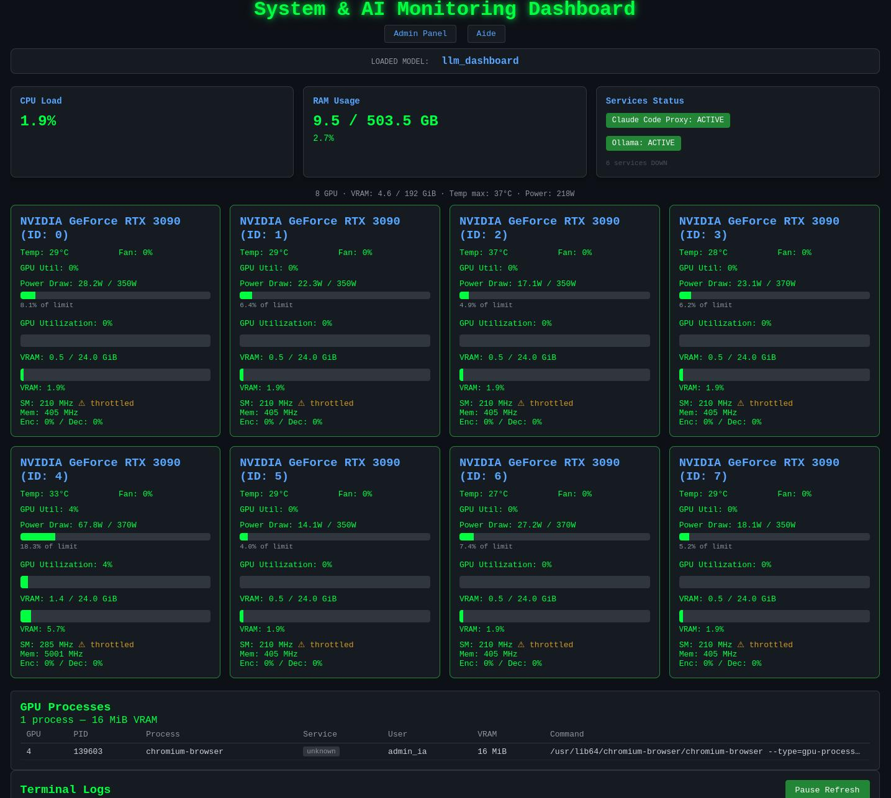
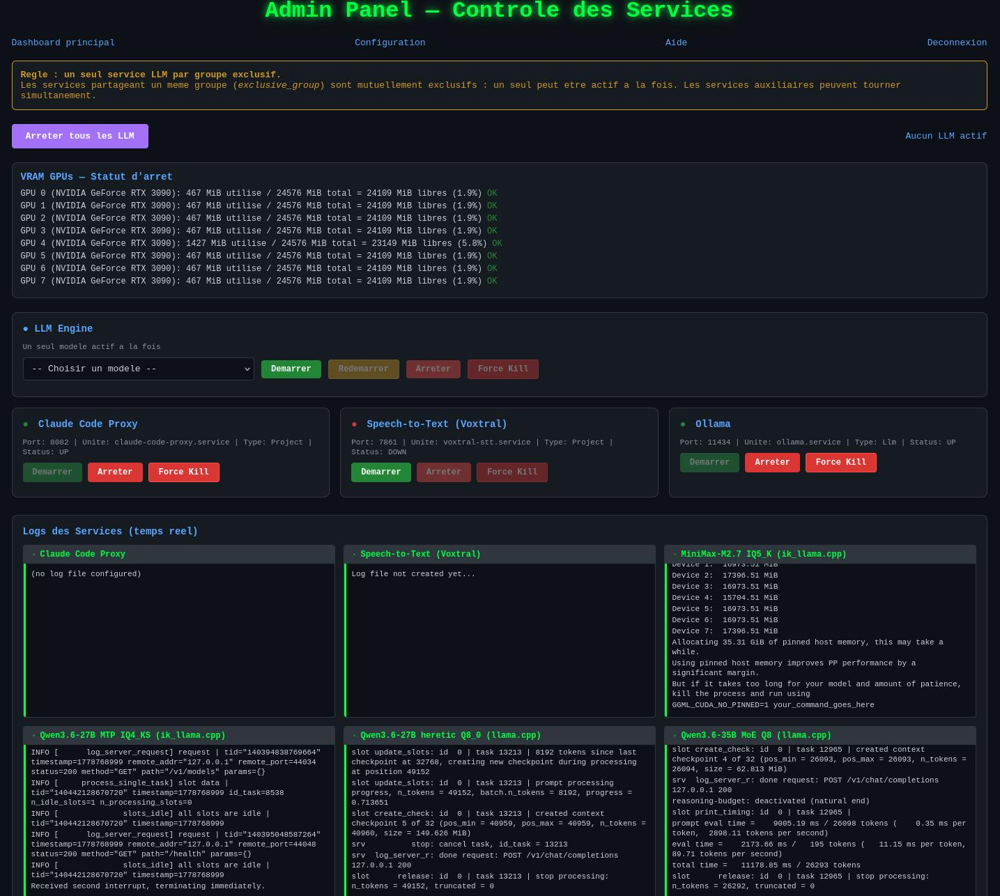
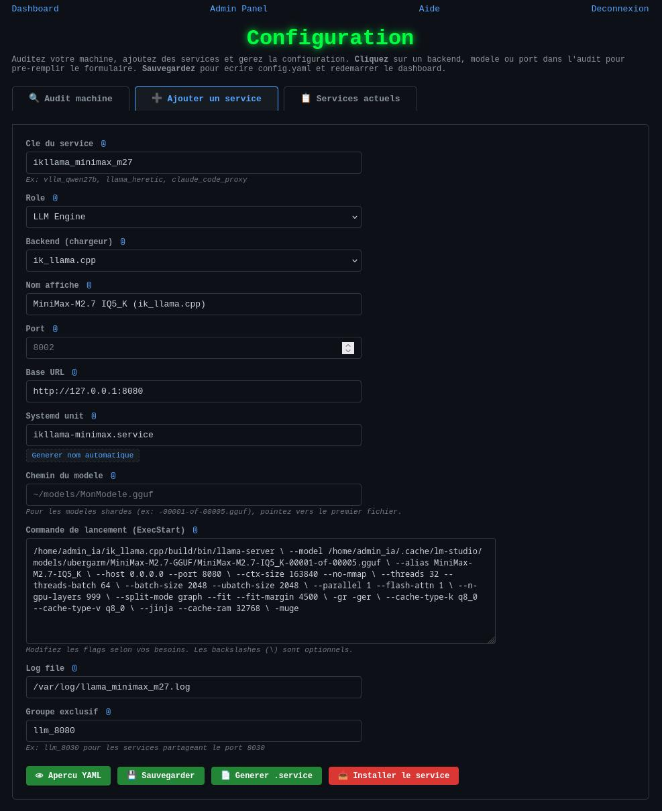

# LLM Dashboard

Lightweight monitoring and administration dashboard for local LLM servers.

Supports **vLLM**, **llama.cpp**, **ik_llama.cpp**, **SGLang**, **Ollama**, **LM Studio** and any OpenAI-compatible API.

## Screenshots

<p align="center">
  
  &nbsp;
  
  &nbsp;
  
</p>

## Features

- **Real-time GPU monitoring** — VRAM, temperature, power, SM/mem clocks, throttling (multi-GPU)
- **Per-service terminal logs** — separate tabs per service, live tail with intelligent noise filtering (per-backend presets: hides access logs, health-check spam, etc.)
- **Active LLM service tracking** — shows both the active LLM service name and the loaded model name
- **Token rate tracking** — prompt + generation tok/s via Prometheus `/metrics`
- **Admin panel** — start/stop/restart/force-kill with CSRF protection
- **Config API** — field whitelist, input validation, atomic config writes, file locking
- **Multi-backend** — vLLM, llama.cpp, ik_llama.cpp, SGLang, Ollama, LM Studio, Gradio, Proxy
- **Exclusive groups** — shared-port LLMs with automatic mutual exclusion
- **Web config page** — audit your machine, add/edit/delete services with merge semantics, generate systemd units
- **Per-backend defaults** — health endpoint, models endpoint, startup time, process patterns auto-filled
- **Prometheus `/metrics` endpoint** — CPU, RAM, GPU, services

## Quick Start

```bash
git clone https://github.com/Martossien/dashboard-llm.git
cd dashboard-llm
conda create -n dashboard-llm python=3.12 -y
conda activate dashboard-llm
pip install -e ".[nvidia]"
cp config.example.yaml config.yaml    # edit if needed, or use /admin/config
python -m llm_dashboard               # http://localhost:5001
```

## Systemd Deployment

```bash
sudo cp scripts/dashboard-llm.service /etc/systemd/system/
sudo systemctl daemon-reload
sudo systemctl enable --now dashboard-llm
```

## Configuration

Use the web UI at `/admin/config` (recommended) or edit `config.yaml` directly.  
See `scripts/GUIDE.md` for full documentation, `config.example.yaml` for a commented template.

`/admin/config` provides:
- **Audit** — auto-detect backends, models, ports, services, GPUs on your machine
- **Add Service** — guided form with per-backend defaults (health endpoint, models endpoint, startup time, process patterns, systemd templates)
- **Edit Service** — merge semantics (existing fields not in the form are preserved); read-only key field
- **Advanced params** — start/stop commands, startup time, model detection regex, process patterns (collapsible section)
- **Log filter** — `default` (auto-filter noise per backend) or `verbose` (show everything)
- **YAML preview** — see config before saving
- **Services** — view, edit, delete configured services

## API

| Endpoint | Description |
|----------|-------------|
| `/api/data` | Full dashboard JSON (CPU, RAM, GPU, services, logs, token rates, active_llm_service_name) |
| `/api/v1/services` | Service status with active groups |
| `/api/v1/gpus` | GPU information |
| `/api/v1/gpus/processes` | GPU process information |
| `/api/v1/metrics` | Metrics JSON |
| `/metrics` | Prometheus endpoint (CPU, RAM, GPU, services) |
| `/health` | Health check |

## Credits

Inspired by [nvitop](https://github.com/XuehaiPan/nvitop), [gpustat](https://github.com/wookayin/gpustat), and the [vLLM](https://github.com/vllm-project/vllm) ecosystem.

## License

MIT